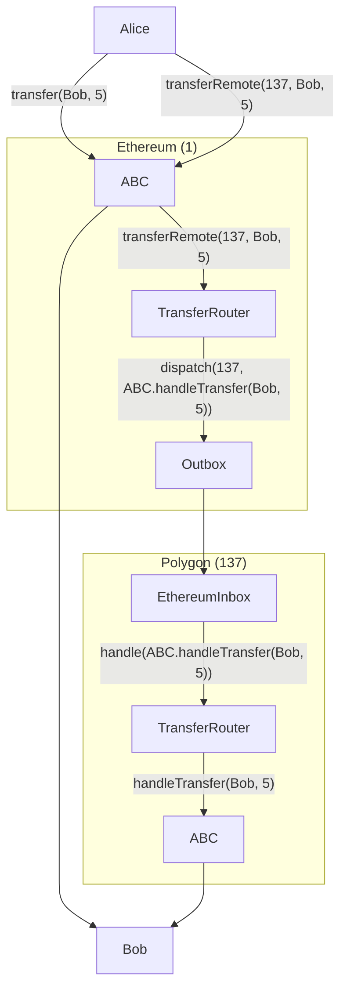
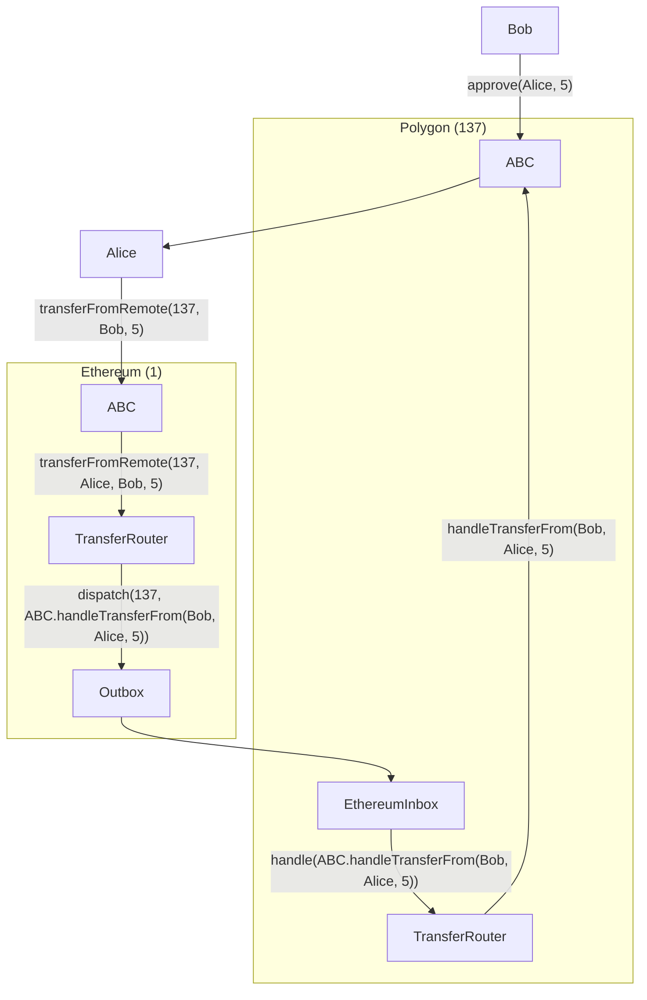

## ABC
### transferRemote

```mermaid
graph TB
    Alice

    subgraph "Ethereum (1)"    
        ABC_E[ABC]
        TR_E[TransferRouter]
        O_E[Outbox]
    end

    subgraph "Polygon (137)"
        ABC_P[ABC]
        TR_P[TransferRouter]
        EthereumInbox
    end

    Bob

    Alice -- "transfer(Bob, 5)" --> ABC_E --> Bob
    Alice -- "transferRemote(137, Bob, 5)" --> ABC_E
    ABC_E -- "transferRemote(137, Bob, 5)" --> TR_E
    TR_E -- "dispatch(137, ABC.handleTransfer(Bob, 5))" --> O_E
    O_E-->EthereumInbox
    EthereumInbox-->|"handle(ABC.handleTransfer(Bob, 5))"|TR_P
    TR_P-->|"handleTransfer(Bob, 5)"|ABC_P
    ABC_P-->Bob
```

### transferFromRemote

```mermaid
graph TB
    Bob
    Alice

    subgraph "Ethereum (1)"    
        ABC_E[ABC]
        TR_E[TransferRouter]
        O_E[Outbox]
    end
    subgraph "Polygon (137)"
        ABC_P[ABC]
        TR_P[TransferRouter]
        EthereumInbox
    end

    Bob -- "approve(Alice, 5)" --> ABC_P
    Alice -- "transferFromRemote(137, Bob, 5)" --> ABC_E
    ABC_E -- "transferFromRemote(137, Alice, Bob, 5)" --> TR_E
    TR_E -- "dispatch(137, ABC.handleTransferFrom(Bob, Alice, 5))" --> O_E
    O_E-->EthereumInbox
    EthereumInbox-->|"handle(ABC.handleTransferFrom(Bob, Alice, 5))"|TR_P
    TR_P-->|"handleTransferFrom(Bob, Alice, 5)"|ABC_P
    ABC_P-->Alice
```

