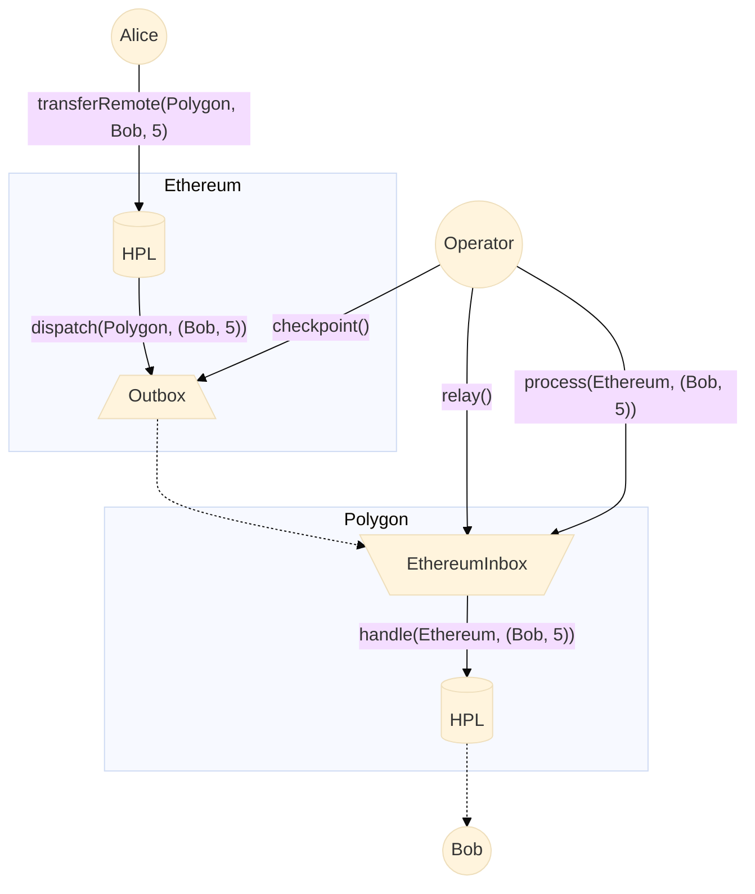

# Interchain tokens using Hyperlane

This repo showcases a Hyperlane ERC20 and ERC721 tokens (HplERC20 and HplERC721). These tokens extend the base standards with an additional `transferRemote` function.

