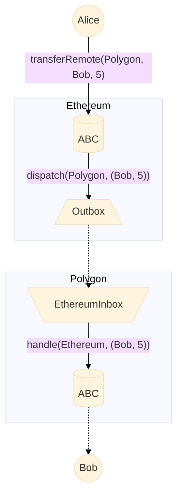

## ABC

`AbcToken` showcases an Abacus Token that extends the ERC20 token with an additional `transferRemote` function.

```mermaid
%%{init: {'theme':'base'}}%%
graph TB
    Alice((Alice))

    subgraph "Ethereum"
        ABC_E[(ABC)]
        O_E[/Outbox\]
    end

    subgraph "Polygon"
        ABC_P[(ABC)]
        EthereumInbox[\EthereumInbox/]
    end

    Bob((Bob))

    Alice -- "transferRemote(Polygon, Bob, 5)" --> ABC_E
    ABC_E -- "dispatch(Polygon, (Bob, 5))" --> O_E
    O_E-.->EthereumInbox
    EthereumInbox-->|"handle(Ethereum, (Bob, 5))"|ABC_P
    ABC_P-.->Bob
```
