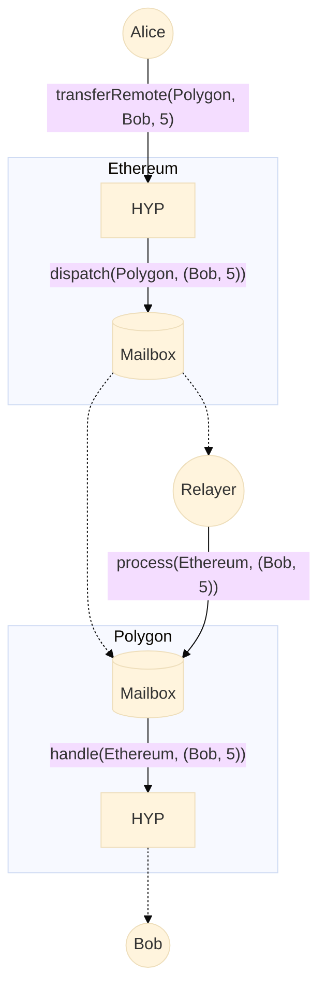

# Interchain tokens using Hyperlane

This repo showcases a Hyperlane ERC20 and ERC721 tokens (HypERC20 and HypERC721). These tokens extend the base standards with an additional `transferRemote` function.



## Setup

```sh
# Install dependencies
yarn

# Build source and generate types
yarn build:dev
```

### (Optional) Using local core contracts

```sh
# yarn link does not work well with workspaces
ln -s ~/path/to/monorepo/solidity node_modules/@hyperlane-xyz/core
```

## Test

```sh
# Run all unit tests
yarn test

# Lint check code
yarn lint
```

## Learn more

For more information, see the [Hyperlane documentation](https://docs.hyperlane.xyz/hyperlane-docs/developers/getting-started).
